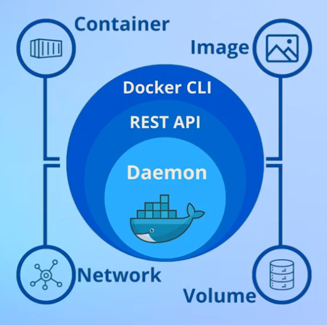
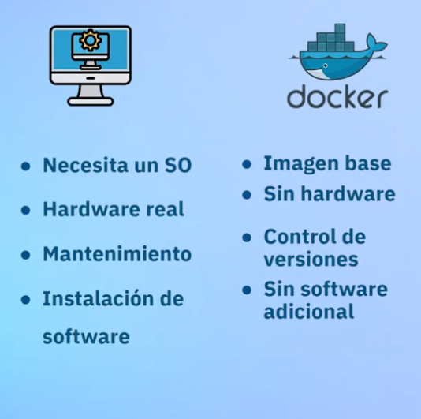
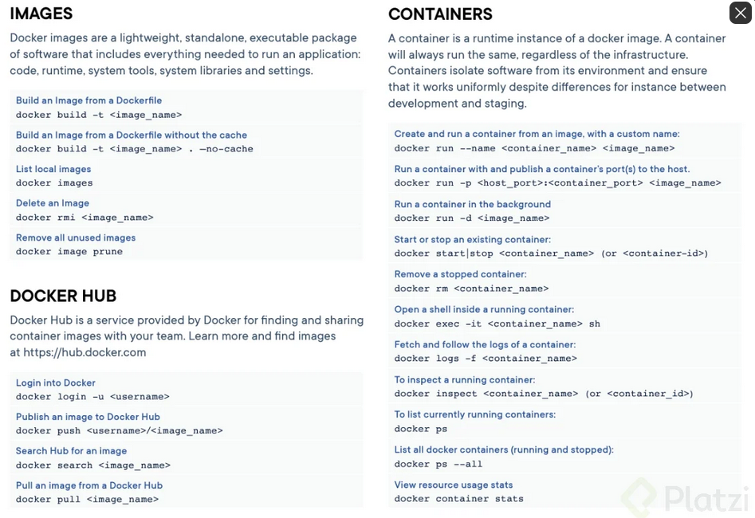

# Curso de Fundamentos de Docker  
Docker permite gestionar y publicar los contenedores. Esta herramienta se puede resumir en la imagen a continuacion:  
  
## 1. Diferencias entre VIM, Services y Containers  
Los contenedores y las virtual machines son complementos una de la otra. Sin embargo, las diferencias se pueden resumir en lo siguiente:  
  

Las maquinas virtuales funciona con sistema operativo y tiene un hardware y se pueden realizar simulaciones. Se pueden tener respaldos de los datos.  
  
Por su parte, en docker son entornos exactos y permite ser uniforme al crear los contenedores. Los hardware son limitados. Permite la escabilidad en las soluciones de software.  
  
## 2. Comandos basicos de Docker:  
1. Revisar version de Docker:   
```shell
docker --version
```  
2. Para mirar las imagenes que tengo instaladas en mi repositorio local:  
```shell
docker images
```  
Para visualizar las que esten arriba:  
```shell
docker ps 
```  
3. Para ayuda: `docker  [comando] --help`
  

Todas las imagenes de docker empiezan por un DockerFile el cual va a contener todos los comandos necesarios para iniciar una imagen de docker.  

## 3. Corriendo una imagen de docker  
Desde la terminal de comandos, lo inicial es crear una build apartir del Dockerfile que se encuentra en el repositorio. El respositorio contiene lo siguiente:  
```docker
FROM nginx

COPY /sitio ./usr/share/nginx/html
```  
Ahora bien, para realizar una build de este archivo, se debe ejecutar lo siguiente en consola:  
```shell
docker build -t sitioweb:latest 
```  
Donde el flag -t asigna un tag y un nombre arrojando lo siguiente:
```shell
REPOSITORY   TAG       IMAGE ID       CREATED         SIZE
sitioweb     latest    8aceb115352b   3 minutes ago   188MB
```  
Para realizar el correr esta imagen hago lo siguiente:  
``` shell 
docker run -it --rm -d -p
```  
El comando run inicializa la imagen, el -it lo realiza de forma interactiva y remueve cualquier version de la imagen que yo este realizando con el comando -rm. Adicional, el comando -d hara que se ejecutara en segundo plano y el -p indica el puerto que voy a utilizar.  

Para el ejercicio de la clase, se utiliza el siguiente comando para correr la imagen:  
``` shell 
docker run -it --rm -d -p 8080:80 --name web sitioweb
```  
## 4. Lista de comandos mas usados:  
  
## 6. Mejorando el docker file  
Esta vez usaremos como plantilla una api basada en Flask de Python.  
El dockerfile esta vez se modifica con las siguientes instrucciones:  
```docker
FROM python:3.12-alpine3.17

WORKDIR /app

COPY requirements.txt requirements.txt
RUN pip install -r requirements.txt

COPY app.py app.py

CMD [ "python", "-m", "flask", "run", "--host", "0.0.0.0" ]
```  
La primera instruccion parte de una imagen de python version 3.12. La palabra reservada WORKDIR nos dice que trabajaremos en el directorio app. En este directorio copiamos el requirements.txt y luego ejecutamos pip el manejador de paquetes para instalar los prerequisitos de nuestro script. Posterior a ello, con la instruccion CMD ejecutamos paso por paso cada uno de los comandos para correr flask de forma nativa en el contenedor.